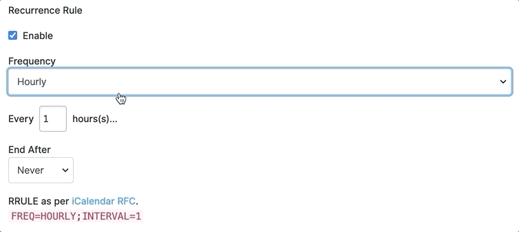

# Events

Events is a Statamic addon that converts entries into single or recurring
events. Recurrences are defined using "recurrence rules" and are fully compliant with [RFC5545](https://tools.ietf.org/html/rfc5545#section-3.3.10). This addons built-in integration with [V-calendar](https://vcalendar.io/), and makes it easy to integrate with any JavaScript plugin.

## Features

What exactly is included with this addon?

1. [Recurrence Rule Fieldtype](./fieldtype.md)
2. [Events Tag](./tags/events.md)
3. [100% compatible with Forms](https://statamic.dev/forms#content)
4. [Import widget for .cal files](import.md)
5. Fully Compliant with [RFC5545](https://tools.ietf.org/html/rfc5545#section-3.3.10)
6. [REST Endpoint](./rest-endpoint.md) (for JavaScript applications)
7. [Vue Events Loader](./vue-events-loader.md)

## Tags

We provides a number of tags to extact event data in various ways.

1. [events](./tags/events.md) :: Just like the [collection tag]([collection](https://statamic.dev/tags/collection#content)) but for event.
2. [events:next](./tags/events-next.md) :: The events after a specified date.
3. [events:by_date](./tags/events-by-date.md) :: Group the events by a specified date format.
4. [events:details](./tags/events-details.md) :: Get a single event by `id` or `slug`.

## Fieldtype

We provide an elegant fieldtype that is loved by both users and developers. [Learn More](./fieldtype.md)

## Import Widget

We also provide a simple widget to upload .cal files. [Learn More](./widgets/import-event.md)

