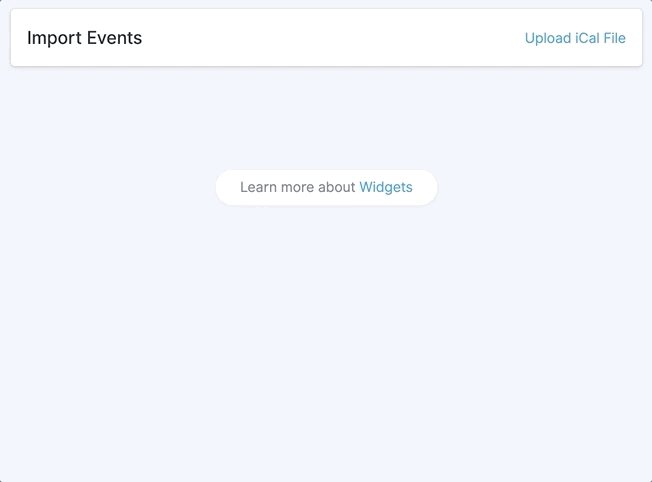

# Import Events Widget



## Configuration

The import widget allows you to configure an importer instance for any channel. To install the widget, open the config file and add the following to the widgets array.

``` php
// config/statamic/cp.php
return [
    'widgets' => [
        [
            'type' => 'import_events',
            'width' => 100,
            'collection' => 'events'
        ]
    ],
];